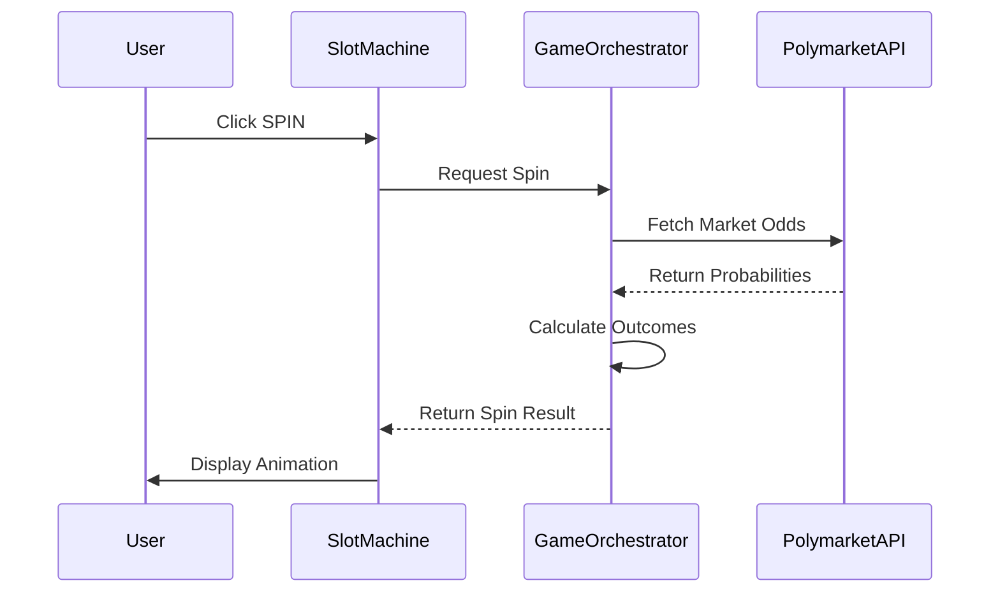

> ## ⚠️ IMPORTANT DISCLAIMER
>
> **This project was created purely for fun and educational purposes!**
>
> This is NOT a trading platform. This is NOT financial advice. Please DO NOT attempt to trade or gamble through this application. It's a demonstration of how prediction market APIs can be gamified into an entertaining slot machine experience.
>
> **Use at your own risk. Entertainment only.** 🎰


---

<div align="center">
  

# PolyNanza! 🍭


[](https://www.typescriptlang.org/)
[](https://reactjs.org/)
[](https://bun.sh/)
[](https://polymarket.com/)

[](./LICENSE.md)
[](https://github.com)
[](https://github.com/isnotcursed/polymarket-casino-slot/stargazers)
[](https://github.com/isnotcursed/polymarket-casino-slot/network/members)
<p align="center">
  <strong>A deliciously addictive slot machine that connects to real Polymarket predictions!</strong>
  <br />
  <em>Educational • Interactive • Sweet</em>
</p>

[🚀 Quick Start](#-quick-start) • [🤝 Contributing](#-contributing)

---

<!-- MAIN SCREENSHOT -->


</div>

---

## 🌟 What is PolyNanza?

**PolyNanza** is a candy-themed slot machine that transforms Polymarket prediction markets into a fun, interactive game! Spin adorable gummy bears and candy symbols while real-time market data determines your outcomes.

### 🔌 How It Works

The slot machine connects to Polymarket's API to fetch live prediction market data (BTC price predictions). 

1. **You click SPIN** → The game checks current market prices
2. **Places a bet** → Buys a position at current market price for your bet amount
3. **Waits for Bet Duration** → Holds the position for the configured time period
4. **Sells the position** → Closes the bet and calculates your profit/loss
5. **Animation plays** → Shows your winning (or losing) combination based on the result!

The real market odds influence your slot results, making it more than just random chance - it's tied to actual prediction markets!


---

## 📸 Screenshots

<details open>
<summary><b>🎮 Gameplay Gallery</b></summary>

<br/>

### Spin Animation


### Bet History Tracking


### Settings & Configuration
<div>
  
  
</div>

</details>

---


## 🚀 Quick Start

### Prerequisites

Make sure you have **Bun** installed:

```bash
# Install Bun (if not already installed)
curl -fsSL https://bun.sh/install | bash
```

### Installation

```bash
# 1. Clone the repository
git clone https://github.com/isnotcursed/polymarket-casino-slot.git
cd polynanza-crush

# 2. Install dependencies
bun install

# 3. Start the development server
bun run dev

------------  OR ------------

./start.sh  # Linux

start.bat   # Windows
```
The app will be available at `http://localhost:3000` 🎉

---

## 🤝 Contributing

Contributions are what make the open source community amazing! 🎉

### How to Contribute

1. **Fork** the project
2. **Create** your feature branch: `git checkout -b feature/AmazingFeature`
3. **Commit** your changes: `git commit -m 'Add some AmazingFeature'`
4. **Push** to the branch: `git push origin feature/AmazingFeature`
5. **Open** a Pull Request

---

## 📜 License

This project is licensed under a **Source-Available (Non-Commercial) License** - see the [LICENSE.md](LICENSE.md) file for details.

---


<div align="center">

### 📬 Questions? Issues?

[](https://github.com/isnotcursed/polymarket-casino-slot/issues)
[](https://github.com/isnotcursed/polymarket-casino-slot/discussions)

**Made with ❤️ and 🍭 | 2026**

[⬆ Back to Top](#polynanza-)

</div>

<!-- ⣇⣿⠘⣿⣿⣿⡿⡿⣟⣟⢟⢟⢝⠵⡝⣿⡿⢂⣼⣿⣷⣌⠩⡫⡻⣝⠹⢿⣿⣷ -->
<!-- ⡆⣿⣆⠱⣝⡵⣝⢅⠙⣿⢕⢕⢕⢕⢝⣥⢒⠅⣿⣿⣿⡿⣳⣌⠪⡪⣡⢑⢝⣇ -->
<!-- ⡆⣿⣿⣦⠹⣳⣳⣕⢅⠈⢗⢕⢕⢕⢕⢕⢈⢆⠟⠋⠉⠁⠉⠉⠁⠈⠼⢐⢕⢽ -->
<!-- ⡗⢰⣶⣶⣦⣝⢝⢕⢕⠅⡆⢕⢕⢕⢕⢕⣴⠏⣠⡶⠛⡉⡉⡛⢶⣦⡀⠐⣕⢕ -->
<!-- ⡝⡄⢻⢟⣿⣿⣷⣕⣕⣅⣿⣔⣕⣵⣵⣿⣿⢠⣿⢠⣮⡈⣌⠨⠅⠹⣷⡀⢱⢕ -->
<!-- ⡝⡵⠟⠈⢀⣀⣀⡀⠉⢿⣿⣿⣿⣿⣿⣿⣿⣼⣿⢈⡋⠴⢿⡟⣡⡇⣿⡇⡀⢕ -->
<!-- ⡝⠁⣠⣾⠟⡉⡉⡉⠻⣦⣻⣿⣿⣿⣿⣿⣿⣿⣿⣧⠸⣿⣦⣥⣿⡇⡿⣰⢗⢄ -->
<!-- ⠁⢰⣿⡏⣴⣌⠈⣌⠡⠈⢻⣿⣿⣿⣿⣿⣿⣿⣿⣿⣿⣬⣉⣉⣁⣄⢖⢕⢕⢕ -->
<!-- ⡀⢻⣿⡇⢙⠁⠴⢿⡟⣡⡆⣿⣿⣿⣿⣿⣿⣿⣿⣿⣿⣿⣿⣿⣿⣿⣷⣵⣵⣿ -->
<!-- ⡻⣄⣻⣿⣌⠘⢿⣷⣥⣿⠇⣿⣿⣿⣿⣿⣿⠛⠻⣿⣿⣿⣿⣿⣿⣿⣿⣿⣿⣿ -->
<!-- ⣷⢄⠻⣿⣟⠿⠦⠍⠉⣡⣾⣿⣿⣿⣿⣿⣿⢸⣿⣦⠙⣿⣿⣿⣿⣿⣿⣿⣿⠟ -->
<!-- ⡕⡑⣑⣈⣻⢗⢟⢞⢝⣻⣿⣿⣿⣿⣿⣿⣿⠸⣿⠿⠃⣿⣿⣿⣿⣿⣿⡿⠁⣠ -->
<!-- ⡝⡵⡈⢟⢕⢕⢕⢕⣵⣿⣿⣿⣿⣿⣿⣿⣿⣿⣶⣶⣿⣿⣿⣿⣿⠿⠋⣀⣈⠙ -->
<!-- ⡝⡵⡕⡀⠑⠳⠿⣿⣿⣿⣿⣿⣿⣿⣿⣿⣿⣿⣿⣿⣿⠿⠛⢉⡠⡲⡫⡪⡪⡣ -->

<!-- Looking for secrets? Wrong place. Probably. -->