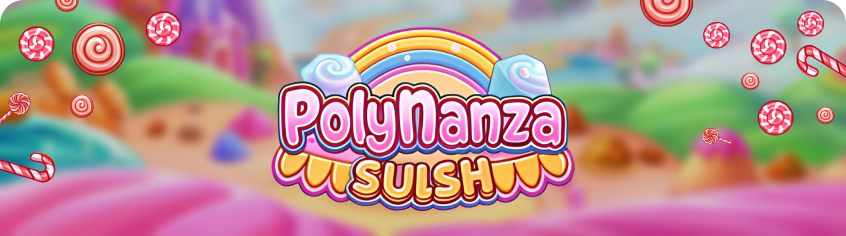
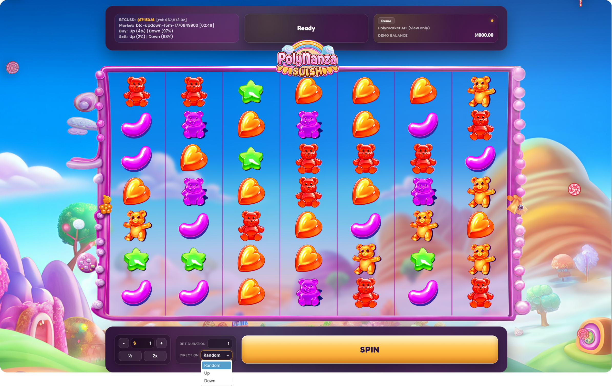
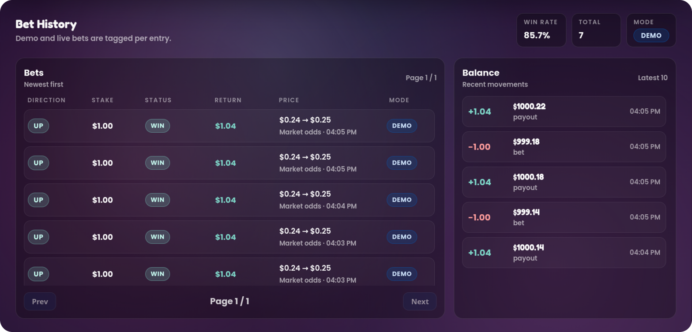
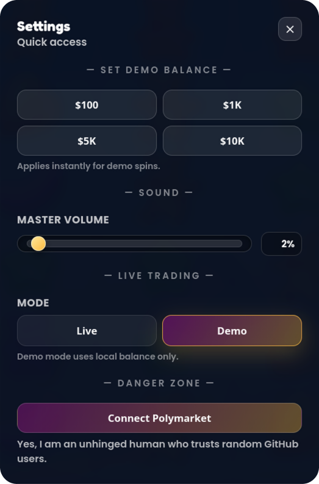
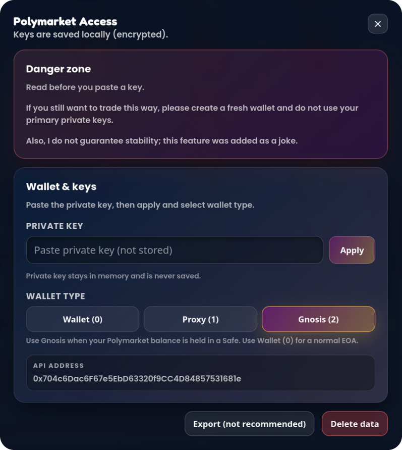
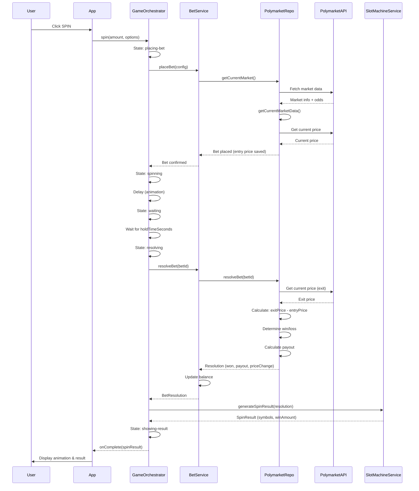

> ## ⚠️ IMPORTANT DISCLAIMER
>
> **PLEASE USE DEMO MODE ONLY! DO NOT connect real API keys or trade with real money.**
> 
> **Use at your own risk.**


---

<div align="center">
  

# PolyNanza! 🍭


[](https://www.typescriptlang.org/)
[](https://reactjs.org/)
[](https://bun.sh/)
[](https://polymarket.com/)

[](./LICENSE.md)
[](https://github.com)
[](https://github.com/isnotcursed/polymarket-casino-slot/stargazers)
[](https://github.com/isnotcursed/polymarket-casino-slot/network/members)
<p align="center">
  <strong>A deliciously addictive slot machine that connects to real Polymarket predictions!</strong>
  <br />
  <em>Educational • Interactive • Sweet</em>
</p>

[🚀 Quick Start](#-quick-start) • [🤝 Contributing](#-contributing)

</div>

---

## 🌟 What is PolyNanza?
**PolyNanza** is a candy-themed slot machine that transforms Polymarket prediction markets into a fun, interactive game! Spin adorable gummy bears and candy symbols while real-time market data determines your outcomes.

**🎮 Play with virtual balance** - The game includes a demo mode with fake money for safe entertainment. While there's API functionality for real market data, **we strongly discourage using it** - stick to demo mode for fun without risk!

---

<!-- MAIN SCREENSHOT -->


---

## 🚀 Quick Start

### Prerequisites

Make sure you have **Bun** installed:

```bash
# Install Bun (if not already installed)
curl -fsSL https://bun.sh/install | bash
```

### Installation

```bash
# 1. Clone the repository
git clone https://github.com/isnotcursed/polymarket-casino-slot.git
cd polynanza-crush

# 2. Install dependencies
bun install

# 3. Start the development server
bun run dev

------------  OR ------------

./start.sh  # Linux

start.bat   # Windows
```
The app will be available at `http://localhost:3000` 🎉

---

## 📸 Screenshots

<details open>
<summary><b>🎮 Gameplay Gallery</b></summary>

<br/>

### Spin Animation


### Bet History Tracking


### Settings & Configuration
<div>
  
  
</div>

</details>

## 🔌 How It Works

The slot machine connects to Polymarket's API and actually trades on live prediction markets (like BTC price predictions). Here's what happens when you spin:

1. **You click SPIN** → Game fetches current market price
2. **Opens a position** → Buys at current market price for your bet amount  
3. **Holds for Bet Duration** → Position stays open for the configured time period
4. **Closes the position** → Sells and calculates profit/loss based on price movement
5. **Animation plays** → Shows winning or losing symbols based on your actual trade result!

Your wins and losses are based on real market price movements - not random number generation. If the market moves in your direction, you win!


```mermaid
sequenceDiagram
    participant User
    participant App
    participant GameOrchestrator
    participant BetService
    participant PolymarketRepo
    participant PolymarketAPI
    
    User->>App: Click SPIN
    App->>GameOrchestrator: spin(amount, options)
    GameOrchestrator->>GameOrchestrator: State: placing-bet
    GameOrchestrator->>BetService: placeBet(config)
    BetService->>PolymarketRepo: getCurrentMarket()
    PolymarketRepo->>PolymarketAPI: Fetch market data
    PolymarketAPI-->>PolymarketRepo: Market info + odds
    PolymarketRepo->>PolymarketRepo: getCurrentMarketData()
    PolymarketRepo->>PolymarketAPI: Get current price
    PolymarketAPI-->>PolymarketRepo: Current price
    PolymarketRepo-->>BetService: Bet placed (entry price saved)
    BetService-->>GameOrchestrator: Bet confirmed
    
    GameOrchestrator->>GameOrchestrator: State: spinning
    GameOrchestrator->>GameOrchestrator: Delay (animation)
    GameOrchestrator->>GameOrchestrator: State: waiting
    GameOrchestrator->>GameOrchestrator: Wait for holdTimeSeconds
    
    GameOrchestrator->>GameOrchestrator: State: resolving
    GameOrchestrator->>BetService: resolveBet(betId)
    BetService->>PolymarketRepo: resolveBet(betId)
    PolymarketRepo->>PolymarketAPI: Get current price (exit)
    PolymarketAPI-->>PolymarketRepo: Exit price
    PolymarketRepo->>PolymarketRepo: Calculate: exitPrice - entryPrice
    PolymarketRepo->>PolymarketRepo: Determine win/loss
    PolymarketRepo->>PolymarketRepo: Calculate payout
    PolymarketRepo-->>BetService: Resolution (won, payout, priceChange)
    BetService->>BetService: Update balance
    BetService-->>GameOrchestrator: BetResolution
    
    GameOrchestrator->>SlotMachineService: generateSpinResult(resolution)
    SlotMachineService-->>GameOrchestrator: SpinResult (symbols, winAmount)
    GameOrchestrator->>GameOrchestrator: State: showing-result
    GameOrchestrator-->>App: onComplete(spinResult)
    App->>User: Display animation & result
```

---

## 🤝 Contributing

Contributions are what make the open source community amazing! 🎉

### How to Contribute

1. **Fork** the project
2. **Create** your feature branch: `git checkout -b feature/AmazingFeature`
3. **Commit** your changes: `git commit -m 'Add some AmazingFeature'`
4. **Push** to the branch: `git push origin feature/AmazingFeature`
5. **Open** a Pull Request

---

## 📜 License

This project is licensed under a **Source-Available (Non-Commercial) License** - see the [LICENSE.md](LICENSE.md) file for details.

---


<div align="center">

### 📬 Questions? Issues?

[](https://github.com/isnotcursed/polymarket-casino-slot/issues)
[](https://github.com/isnotcursed/polymarket-casino-slot/discussions)

**Made with ❤️ and 🍭 | 2026**

[⬆ Back to Top](#polynanza-)

</div>

<!-- ⣇⣿⠘⣿⣿⣿⡿⡿⣟⣟⢟⢟⢝⠵⡝⣿⡿⢂⣼⣿⣷⣌⠩⡫⡻⣝⠹⢿⣿⣷ -->
<!-- ⡆⣿⣆⠱⣝⡵⣝⢅⠙⣿⢕⢕⢕⢕⢝⣥⢒⠅⣿⣿⣿⡿⣳⣌⠪⡪⣡⢑⢝⣇ -->
<!-- ⡆⣿⣿⣦⠹⣳⣳⣕⢅⠈⢗⢕⢕⢕⢕⢕⢈⢆⠟⠋⠉⠁⠉⠉⠁⠈⠼⢐⢕⢽ -->
<!-- ⡗⢰⣶⣶⣦⣝⢝⢕⢕⠅⡆⢕⢕⢕⢕⢕⣴⠏⣠⡶⠛⡉⡉⡛⢶⣦⡀⠐⣕⢕ -->
<!-- ⡝⡄⢻⢟⣿⣿⣷⣕⣕⣅⣿⣔⣕⣵⣵⣿⣿⢠⣿⢠⣮⡈⣌⠨⠅⠹⣷⡀⢱⢕ -->
<!-- ⡝⡵⠟⠈⢀⣀⣀⡀⠉⢿⣿⣿⣿⣿⣿⣿⣿⣼⣿⢈⡋⠴⢿⡟⣡⡇⣿⡇⡀⢕ -->
<!-- ⡝⠁⣠⣾⠟⡉⡉⡉⠻⣦⣻⣿⣿⣿⣿⣿⣿⣿⣿⣧⠸⣿⣦⣥⣿⡇⡿⣰⢗⢄ -->
<!-- ⠁⢰⣿⡏⣴⣌⠈⣌⠡⠈⢻⣿⣿⣿⣿⣿⣿⣿⣿⣿⣿⣬⣉⣉⣁⣄⢖⢕⢕⢕ -->
<!-- ⡀⢻⣿⡇⢙⠁⠴⢿⡟⣡⡆⣿⣿⣿⣿⣿⣿⣿⣿⣿⣿⣿⣿⣿⣿⣿⣷⣵⣵⣿ -->
<!-- ⡻⣄⣻⣿⣌⠘⢿⣷⣥⣿⠇⣿⣿⣿⣿⣿⣿⠛⠻⣿⣿⣿⣿⣿⣿⣿⣿⣿⣿⣿ -->
<!-- ⣷⢄⠻⣿⣟⠿⠦⠍⠉⣡⣾⣿⣿⣿⣿⣿⣿⢸⣿⣦⠙⣿⣿⣿⣿⣿⣿⣿⣿⠟ -->
<!-- ⡕⡑⣑⣈⣻⢗⢟⢞⢝⣻⣿⣿⣿⣿⣿⣿⣿⠸⣿⠿⠃⣿⣿⣿⣿⣿⣿⡿⠁⣠ -->
<!-- ⡝⡵⡈⢟⢕⢕⢕⢕⣵⣿⣿⣿⣿⣿⣿⣿⣿⣿⣶⣶⣿⣿⣿⣿⣿⠿⠋⣀⣈⠙ -->
<!-- ⡝⡵⡕⡀⠑⠳⠿⣿⣿⣿⣿⣿⣿⣿⣿⣿⣿⣿⣿⣿⣿⠿⠛⢉⡠⡲⡫⡪⡪⡣ -->

<!-- Looking for secrets? Wrong place. Probably. -->
